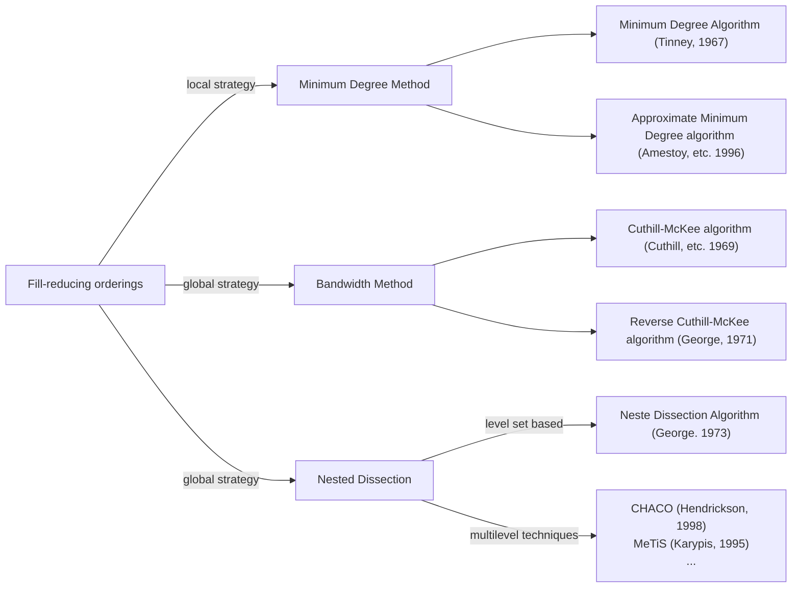

Dataset: https://drive.google.com/drive/folders/1Ln0gqM0jPDR8x4VWJpiMWE-TfGw3vzXd?usp=share_link

# Problem Statement

we wish to solve 

$$
Ax=b
$$

with $A$ sparse and symmetric. If $P$ is a permuation matrix,  the system of linear equation can be writtem:

$$
PAP^TPx=Pb
$$

or if $B=PAP^T$, $y=Px$ , and $c=Pb$

$$
By=c
$$

where $B$ is  the permeated form of $A$ it is also sparse and symmetric. If $A$ is positive definite, $B$ is also positive definite.

The amount of fill-in requred to factorize $B$ depend on $P$. Our goal is to find a convinient $P$ that results in the least possible fill-in after factorisation.

$$
argmin_{P}\ ||L||_0\\
s.t\ \ \ \ PAP^T = LL^T\\
Ax =b\\
$$

